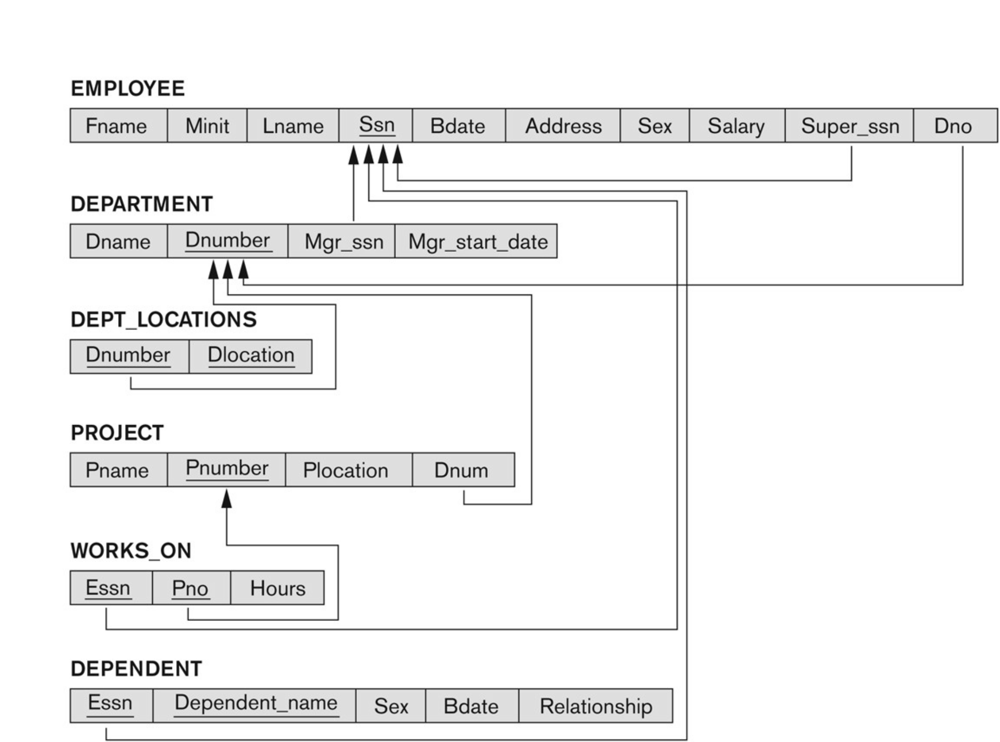

# Company Database Management System

This repository contains the SQL scripts to build, populate, and query a relational database designed to manage organizational data. The schema models the relationships between employees, departments, projects, and dependents.

## Files

* **`DDL.sql`**: Defines the database schema (Tables, Primary Keys, Foreign Keys, and Constraints).
* **`DML.sql`**: Populates the tables with sample data.
* **`query.sql`**: Contains various SQL queries for data analysis and reporting.

## Database Schema

The database consists of the following entities:

* **EMPLOYEE**: Stores personal info, salary, supervisor, and department assignment.
* **DEPARTMENT**: Manages department details and identifies the manager.
* **DEPT_LOCATIONS**: Handles multi-valued locations for departments.
* **PROJECT**: Tracks projects controlled by specific departments.
* **WORKS_ON**: A junction table linking Employees to Projects to track hours worked.
* **DEPENDENT**: Stores family members associated with an employee.

## How to Run

Due to the circular relationship between **Employee** (belongs to Dept) and **Department** (managed by Emp), the execution order is critical:

1.  **Execute `DDL.sql`**:
    * This script creates the tables first.
    * It applies the circular Foreign Key constraints (`FK_Dept_Mgr` and `FK_Emp_Dept`) using `ALTER TABLE` at the end to avoid errors.
2.  **Execute `DML.sql`**:
    * Inserts the sample data into the tables.
3.  **Execute `query.sql`**:
    * Run specific queries to test the database functionality.
